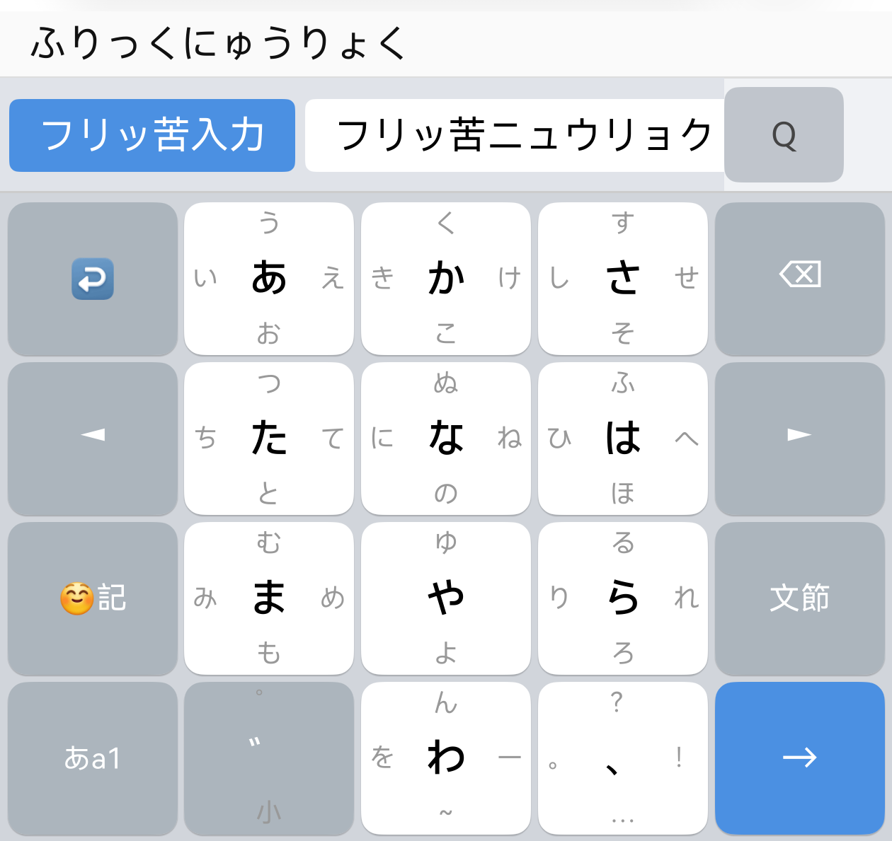
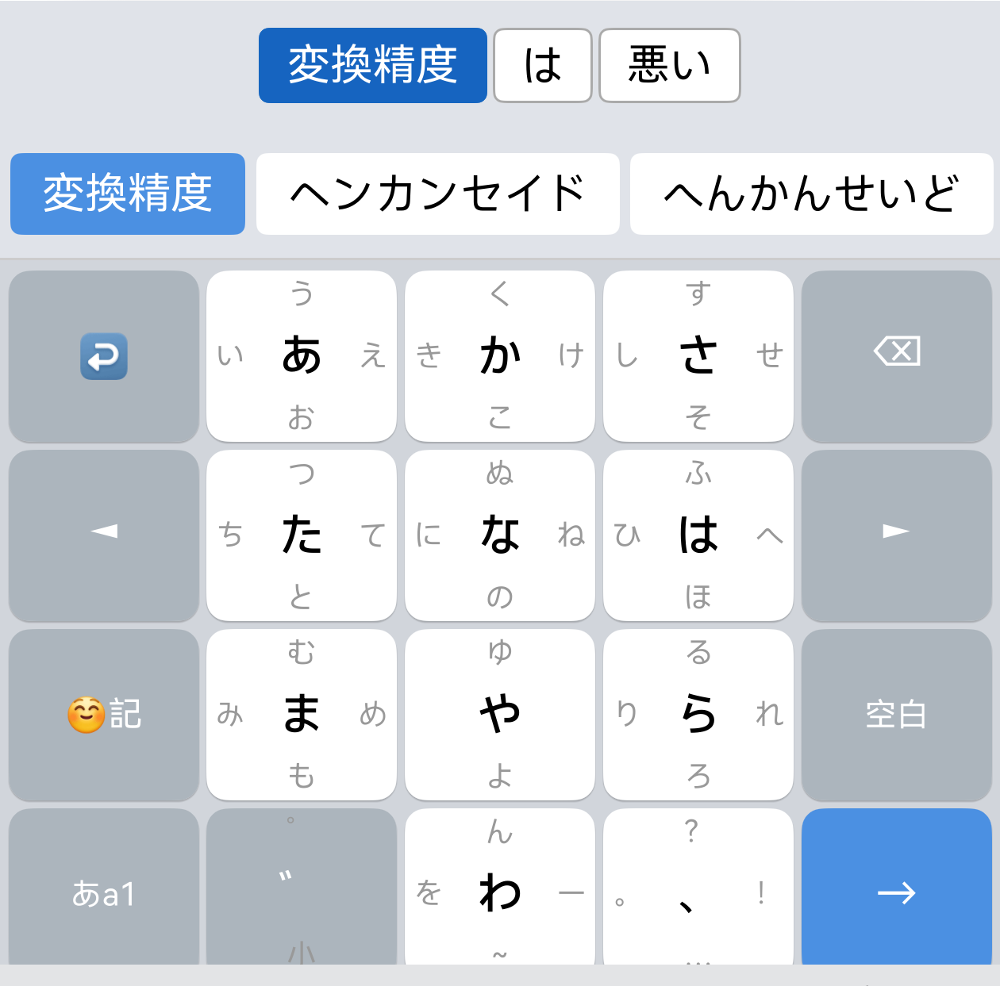

# shunti Japanese IME — HarmonyOS NEXT 日本語入力

HarmonyOS NEXT (API 12+) 向けの日本語 IME です。フリック入力・QWERTY ローマ字入力の両方に対応し、SKK-JISYO.L ベースの大規模辞書による高精度な漢字変換を提供します。

> **開発者**: shuntilettuce

---

## インストール

**Huawei AppGallery** から入手できます（審査通過後、順次公開予定）。

AppGallery でアプリを検索して「インストール」をタップした後、以下の手順で有効化してください。

**有効化手順：**
1. 設定 → 通用 → 输入法（言語と入力）→ デフォルト入力メソッド
2. 一覧に表示された **shunti Japanese IME** を選択

---

## 機能一覧

### 入力方式
| 機能 | 説明 |
|---|---|
| **フリック入力** | Gboard 風 4×5 レイアウト。上下左右フリックでかな入力 |
| **QWERTY ローマ字入力** | 全ローマ字パターン対応（っ/ん/拗音含む） |
| **モード切替** | ひらがな / カタカナ / 英数字をワンタップで切替 |
| **濁点・半濁点** | フリックキーで゛゜を即時付与・サイクル |

### 変換
| 機能 | 説明 |
|---|---|
| **リアルタイム候補表示** | 入力中に Viterbi 文節分割で自動変換候補を更新 |
| **スペース変換** | スペースで候補一覧表示 → 繰り返しで次候補へ |
| **文節変換モード** | 文全体を文節に分割して個別に変換先を選択 |
| **カタカナ変換** | 全文をカタカナに変換する候補を常に提供 |
| **大規模辞書** | SKK-JISYO.L 由来 30 万エントリ超（地名・固有名詞辞書含む） |
| **変換学習** | 選んだ変換先の優先度を自動で上げ、次回から上位表示 |
| **ユーザー辞書** | アプリ本体から「よみ→単語」を登録、変換候補の先頭に表示 |
| **括弧変換** | 「かっこ」で `()` `「」` `【】` 等を入力。確定後カーソルが内側へ移動 |

### キーボード操作
| 機能 | 説明 |
|---|---|
| **長押し削除** | ⌫ 長押し 0.5秒後に 10文字/秒で連続削除 |
| **取り消し (↩)** | 直前に確定したテキストを削除して復元 |
| **カーソル移動** | ◄ ► キーでカーソル左右移動 |
| **記号パネル** | 約 300 種の記号・矢印・数学記号・全角文字 |
| **絵文字パネル** | 8 カテゴリ 512 種の絵文字 |

---

## スクリーンショット

| フリック入力 | 変換候補 | 記号パネル |
|---|---|---|
|  |  |  |

---

## プロジェクト構造

```
entry/src/main/ets/
├── inputmethodextability/
│   └── InputMethodExtAbility.ets   ← IME エントリポイント
├── entryability/
│   └── EntryAbility.ets            ← アプリ本体エントリポイント
├── ime/
│   ├── KeyboardController.ets      ← パネル管理・InputHandler・状態管理
│   ├── JapaneseConverter.ets       ← ローマ字→かな FSM
│   └── KanaKanjiConverter.ets      ← かな→漢字変換・Viterbi 文節分割・学習
├── pages/
│   ├── KeyboardPage.ets            ← キーボード UI ページ（モード分岐）
│   ├── Index.ets                   ← アプリ本体（ユーザー辞書登録 UI）
│   └── PrivacyPolicy.ets           ← プライバシーポリシー画面
└── components/
    ├── FlickKeyboardView.ets        ← フリックキーボード
    ├── KeyboardView.ets             ← QWERTY キーボード
    ├── CandidateBar.ets             ← 変換候補バー
    ├── BunsetsuBar.ets              ← 文節変換バー
    ├── SymbolView.ets               ← 記号入力パネル
    └── EmojiView.ets                ← 絵文字入力パネル

tools/
├── skk_convert.py                  ← SKK-JISYO.L → dict.json 変換スクリプト
└── build_viterbi_dict.py           ← mecab-ipadic → reading_cost.json / matrix.json 生成
```

---

## ソースからビルドする（開発者向け）

### 前提条件

- DevEco Studio (API 20 以上)
- Huawei 開発者アカウント（署名には AppGallery Connect のプロジェクトが必要）

### 手順

```sh
git clone https://github.com/shuntilettuce/japanese-ime-for-harmonyos-next.git
cd japanese-ime-for-harmonyos-next
git checkout claude/harmonyos-japanese-ime-app-3OaxO  # 開発ブランチ
```

DevEco Studio でプロジェクトを開き、File → Project Structure → Signing Configs でデバッグ署名を設定後、▶ ボタンで実機またはエミュレーターにデプロイできます。

### 辞書の再生成（オプション）

dict.json を SKK-JISYO から再生成する場合：

```sh
# SKK 辞書をダウンロード（https://github.com/skk-dev/dict）
python3 tools/skk_convert.py \
    /tmp/SKK-JISYO.L \
    /tmp/SKK-JISYO.geo \
    /tmp/SKK-JISYO.propernoun
```

---

## AppGallery リリース手順

### 1. リリース署名の準備

1. **AppGallery Connect** → アカウントセンター → 証明書管理 → 証明書を作成
   - アルゴリズム: RSA 2048 または SM2
   - `.cer`（公開証明書）と `.p7b`（プロビジョニングプロファイル）をダウンロード
2. DevEco Studio → File → Project Structure → Signing Configs → release
   - `storeFile`, `storePassword`, `keyAlias`, `keyPassword` を設定
3. **Build → Build Hap(s)/APP(s) → Build Release APP(s)** でリリース `.app` を生成

> `.p7b` は秘密鍵に相当します。リポジトリにコミットしないでください。

### 2. バージョン管理

`AppScope/app.json5` を更新します。

```json
{
  "app": {
    "versionCode": 1020000,   // 整数。毎リリースごとに必ず増加させること
    "versionName": "1.2.0"
  }
}
```

### 3. AppGallery Connect への提出

#### 審査通過のための注意事項

AppGallery 審査では以下の点が重点チェックされます（過去に実際にリジェクトされた項目）。

| 審査項目 | 対応内容 |
|---------|---------|
| **初回起動時のプライバシー同意** | 同意ダイアログ実装済み（未同意の場合はアプリ終了） |
| **プライバシーポリシー URL** | GitHub Pages でホスト（下記参照） |
| **アプリ名の一致** | AGC 登録名と `app.json5` / `string.json` の名称を **完全一致**させること |
| **アイコンの透過なし** | 背景レイヤーは不透明な RGB PNG を使用 |
| **deviceTypes の宣言** | 対応していないデバイス種別（tablet, foldable 等）を宣言しないこと |
| **向きの固定** | スマートフォンのみ対応 → `"orientation": "portrait"` を設定済み |

#### AGC 提出情報

| 項目 | 値 |
|------|---|
| アプリ名 | shunti Japanese IME |
| カテゴリ | ツール |
| 対象年齢 | 3歳以上 |
| 配布地域 | 中国本土を除く全世界 |
| プライバシーポリシー URL | `https://shuntilettuce.github.io/japanese-ime-for-harmonyos-next/privacy-policy` |

#### プライバシーポリシー URL の設定

GitHub Pages を使用します：

1. リポジトリの Settings → Pages → Source: branch `main`, folder `/docs`
2. 有効化後、`https://shuntilettuce.github.io/japanese-ime-for-harmonyos-next/privacy-policy` でアクセス可能

日本語・英語・中国語のポリシーページは `docs/` に用意済みです。

---

## プライバシーポリシー

- [日本語](https://shuntilettuce.github.io/japanese-ime-for-harmonyos-next/privacy-policy)
- [English](https://shuntilettuce.github.io/japanese-ime-for-harmonyos-next/privacy-policy-en)
- [中文](https://shuntilettuce.github.io/japanese-ime-for-harmonyos-next/privacy-policy-zh)

本アプリは入力内容・変換履歴を外部サーバーへ一切送信しません。すべての処理はデバイス内で完結します。

---

## ライセンス

### アプリコード

`.ets` ファイル等のアプリ独自コードは **MIT License** で提供します。  
ただし dict.json を含む配布物全体は GPL v2 の制約を受けます（下記参照）。

### 変換辞書 (dict.json)

`entry/src/main/resources/rawfile/dict.json` は [SKK-JISYO.L](https://github.com/skk-dev/dict) / [SKK-JISYO.geo](https://github.com/skk-dev/dict) / [SKK-JISYO.propernoun](https://github.com/skk-dev/dict) を変換・加工したものです。

**GNU General Public License v2.0 以降** が適用されます。

> Copyright (C) 1988-1995, 1997, 1999-2014  
> Masahiko Sato, Hironobu Takahashi, and SKK Development Team \<skk@ring.gr.jp\>  
> Source: https://github.com/skk-dev/dict

詳細は [NOTICE](./NOTICE) および [LICENSES/GPL-2.0.txt](./LICENSES/GPL-2.0.txt) を参照してください。

### 文節分割データ (reading_cost.json / matrix.json)

`reading_cost.json`（単語コスト・品詞）と `matrix.json`（品詞接続コスト行列）は
[mecab-ipadic](https://taku910.github.io/mecab/) 2.7.0 を加工したもので、Viterbi 文節分割に使用します。

**NAIST License**（商用利用可）が適用されます。

> Copyright 2000–2003 Nara Institute of Science and Technology (NAIST). All Rights Reserved.  
> 辞書エントリの大部分は ICOT Free Software に由来します。

詳細は [NOTICE](./NOTICE) および [LICENSES/mecab-ipadic-COPYING.txt](./LICENSES/mecab-ipadic-COPYING.txt) を参照してください。
